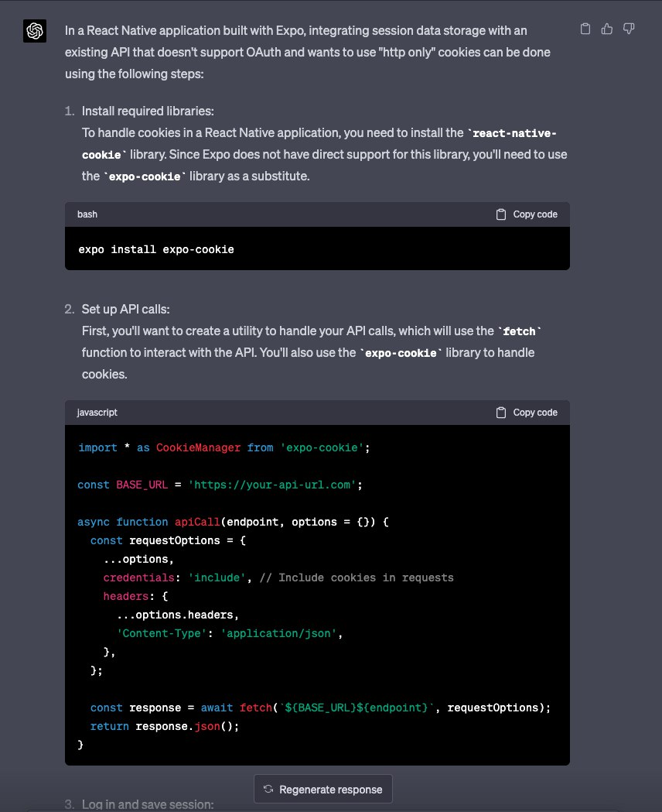

# Expo Cookie

If you area reading this, you are likely now aware that this package does 
not really operate as expected. There is no way as of 4/20/23 to manage
cookies in the Expo app framework. You have to eject to handle the 
requests at a lower level. 

This package represents a joke that was created because GPT-4 Chat suggested
including expo-cookie as an option to get around our issue but we found 
this library did not really exist. 

